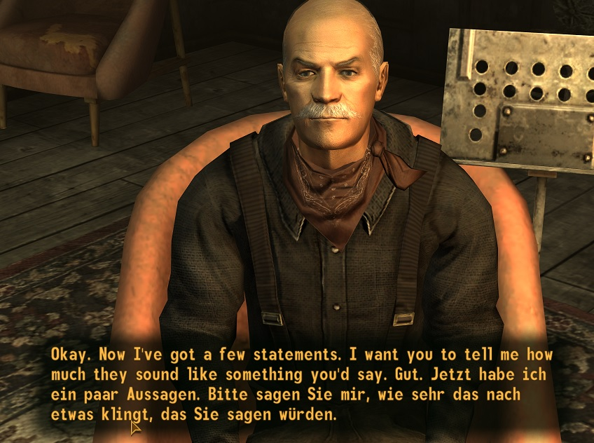
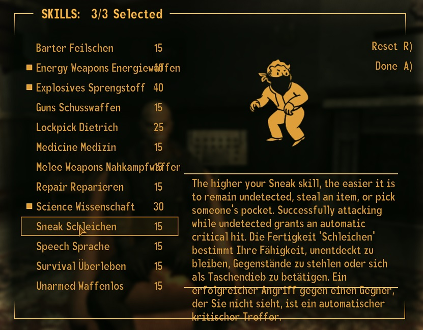

Hello, I am making dual language subtitles for Fallout New Vegas for a bit of fun,

The workflow I came up with was:

Using the excellent application 'xtranslator':
Load FalloutNV.esm
Change the destination and source language to the same thing in 'Options -> dictionaries and languages'
Export 'Everything'

I then use Python to read the XML and append (for instance) the German language's text to the English language's text in the <Dest> tag

I then use xtranslator to stuff it all back in there

It breaks old saves (you fall through the floor forever) but works with new ones

(does seem to increase frequency of crashing)

Proof:

